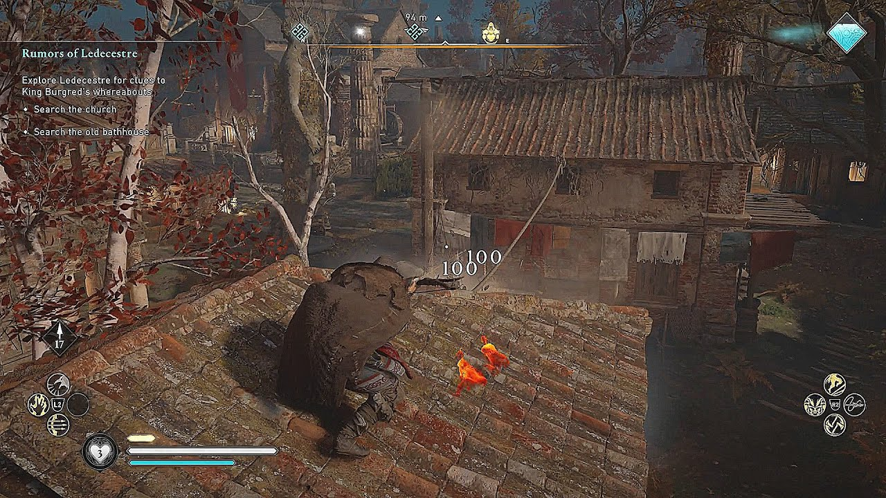
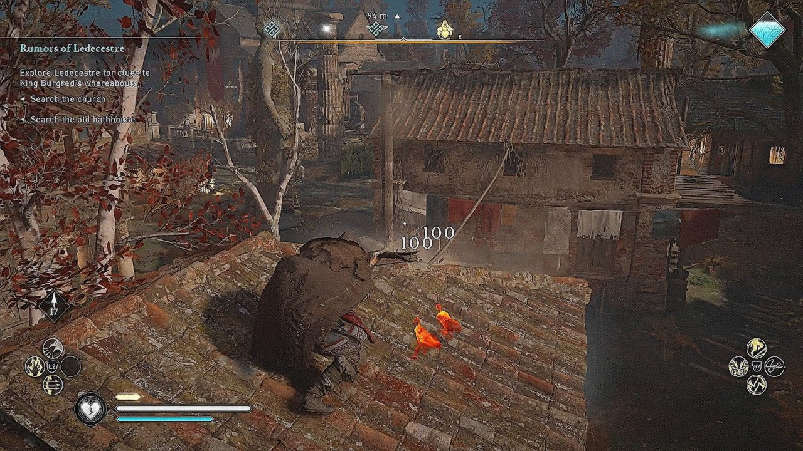

# DeblurGAN - Image Deblurring
Unofficial implementation of the DeblurGAN model based on the paper [DeblurGAN: Blind Motion Deblurring Using Conditional Adversarial Networks](https://arxiv.org/pdf/1609.04802v5). With this repository, you will be able to implement the model from scratch using your own dataset. The steps to train and test the model, along with the project details, are explained below.

## Dataset preparation

To prepare the dataset, you should first run the file `dataset.py`, setting the parameters at the beginning of the file as desired. These parameters are:

- **dataset_path**: specify the paths where the images to be used for training are located, separated by the character `;`.
- **train_split**: defines the ratio for splitting images into training and validation sets. For example, if there are 100 images and this parameter is set to 0.8, then 80% of the images will be used for training and the remaining 20% for validation.

The script lists all image paths in the given folders, shuffles them randomly, and then splits them into training and validation sets according to the **train_split** parameter. Finally, two _JSON_ files will be generated: one containing the training image paths and the other containing the validation image paths. These _JSON_ files will be used during training to load the images. I trained the model on all the scenarios from the [TartanAir](https://theairlab.org/tartanair-dataset/) dataset, which contains image sequences at 480×640 resolution.

## Train the model
To train the model, you can adjust the parameters and hyperparameters as needed. In my experiments, I used the same values as in the original paper, but I implemented a different approach to blur the images. Specifically, I use the [OpenCV](https://opencv.org/) function [GaussianBlur](https://docs.opencv.org/4.x/d4/d86/group__imgproc__filter.html#gae8bdcd9154ed5ca3cbc1766d960f45c1), selecting a kernel size of 5 and a sigma value of 5.0 as well. To start the training, run:
```
python train.py
```
When the training starts, a folder is created. The folder name consists of the name provided in the parameters, followed by relevant information about the training parameters, such as batch size, learning rate, number of residual blocks added to the network, and weighting parameters for the loss function. This way, you can always identify the parameter values used for the training. In my case, the name of my training folder is ```deblurGAN_bs1_lr0.0001_numresblocks9_lambdaG100_lambdaD10/```. Five txt files are stored in this folder, containing the values of the generator loss and the discriminator loss and accuracy at each epoch. Additionally, within this folder, a subfolder called ```checkpoints/``` is created to store the model every 10 epochs.

## Test the model
To test the model, specify the checkpoint to be evaluated in the parameters, along with the name of the folder containing the model file. Place the images you want to deblur in the `test_images/original/` folder and run:
```
python test_images.py
```
The Gaussian-blurred images and the model-deblurred ones are saved in the ```test_images/blurred/``` and ```test_images/deblurred/``` folders, respectively, with the same file name. I’ve uploaded an example image to this repository, which you can also see below. The image corresponds to a screenshot from the video game **Assassin’s Creed Valhalla**.

The same process used for images can also be applied to videos. You can place some video files in the ```test_videos/original/``` folder, and run
```
python test_videos.py
```
This will generate the blurred and deblurred versions of the videos in the ```test_videos/blurred/``` and ```test_videos/deblurred/``` folders, respectively, using the same file names.

NOTE: the files in these folders are not real video files, they are just empty placeholders to illustrate the expected structure. Similarly, the files in the ```checkpoints/``` folder are not real model files and are also empty placeholders for demonstration purposes.

### Original image


### Blurred image


### Deblurred image

